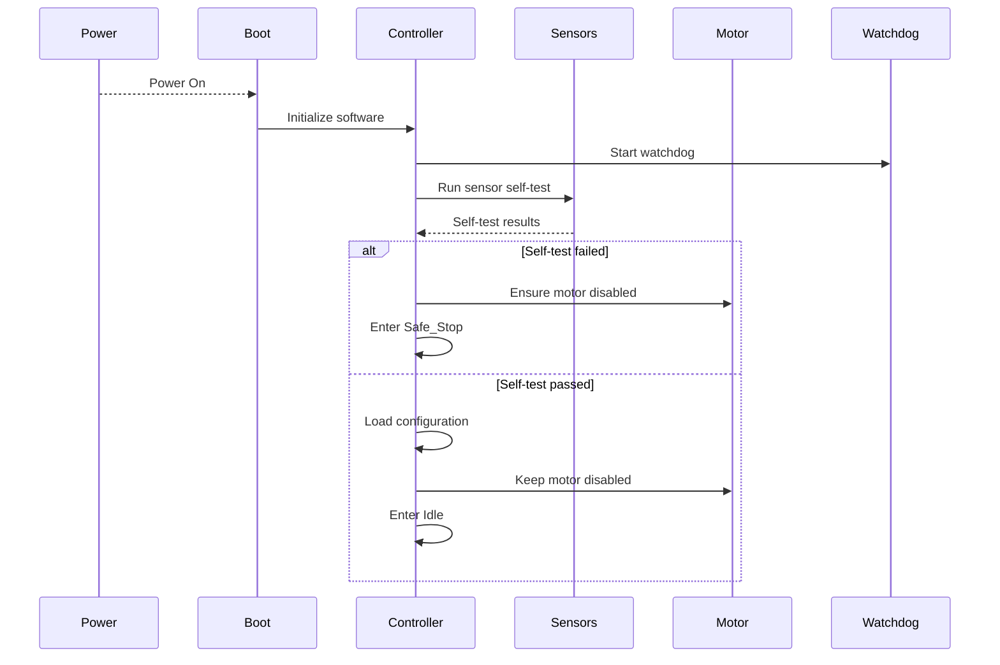
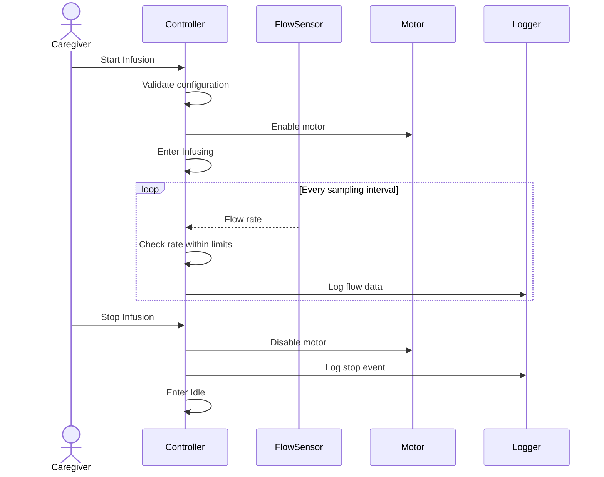
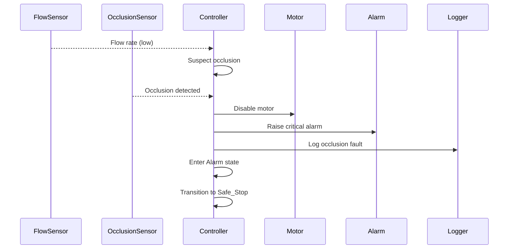
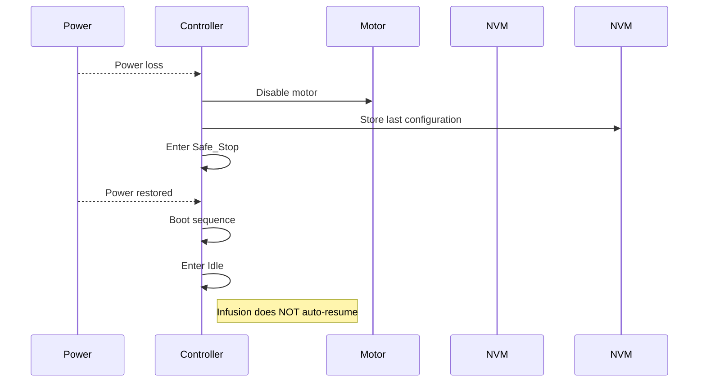

## 1. Key Sequence Diagrams

### SD-1: System Start-up

---

### SD-2: Normal Infusion (Sunny Day)

---

### SD-3: Safety-Critical – Occlusion

---

### SD-4: Recovery After Fault

---

## 2. Traceability Matrix

| Requirement | Statechart Element(s) | Sequence Diagram(s) | Test ID |
|------------|------------------------|----------------------|---------|
| R-F1 Deliver at rate | Infusing | SD-2 | T-1 |
| R-F2 Start/Stop | Idle, Infusing | SD-2, SD-4 | T-2 |
| R-S1 Stop on occlusion | Alarm, Safe_Stop | SD-3 | T-3 |
| R-S2 Door open | Alarm | SD-3 | T-4 |
| R-P1 Power loss | Safe_Stop | SD-1 | T-5 |
| R-P2 No auto-resume | Idle | SD-4 | T-6 |

---

## 3. Test Plan

The tests are **design-level** and do not include implementation details.

## T-1: Startup Self-Test and Safe Initialization

**Related Requirements**
- R-FD1: Detect invalid or missing sensor data  
- R-P1: Stop infusion immediately upon power loss  

**Purpose**  
Verify that the system initializes safely, performs self-tests, and does not begin infusion unintentionally.

**Preconditions**
- Device powered off
- Sensors connected or simulated
- Motor initially disabled

**Stimulus**
- Apply power to the system

**Test Steps**
1. Power on the device
2. Observe initialization sequence
3. Observe sensor self-test execution
4. Observe motor control signals

**Observations / Measurements**
- System state transitions
- Self-test status flags
- Motor enable/disable signal
- Watchdog initialization

**Expected Outcome**
- System performs sensor self-tests
- Motor remains disabled
- System enters `Idle` if tests pass
- System enters `Safe_Stop` if tests fail

**Pass/Fail Criteria**
- PASS if no motor activity occurs before entering `Idle`
- FAIL if infusion starts or motor activates unintentionally

---

## T-2: Normal Infusion Start and Stop (Sunny Day)

**Related Requirements**
- R-F1: Deliver medication at configured rate  
- R-F2: Start and stop infusion via user command  

**Purpose**  
Verify correct infusion behavior under normal operating conditions.

**Preconditions**
- System in `Idle`
- Valid configuration parameters loaded
- No active fault conditions

**Stimulus**
- User issues “Start Infusion” command
- User issues “Stop Infusion” command

**Test Steps**
1. Issue start command
2. Observe transition to `Infusing`
3. Monitor flow rate periodically
4. Issue stop command
5. Observe transition to `Idle`

**Observations / Measurements**
- Motor enable signal
- Flow rate values
- System state
- Event logs

**Expected Outcome**
- Infusion starts only after explicit start command
- Flow rate remains within allowed tolerance
- Infusion stops immediately on stop command

**Pass/Fail Criteria**
- PASS if start/stop behavior and flow rate are correct
- FAIL if infusion continues after stop or rate is out of bounds

---

## T-3: Occlusion Detection and Safety Preemption

**Related Requirements**
- R-S1: Stop infusion after detecting occlusion  
- R-A1: Generate safety alarm for critical conditions  

**Purpose**  
Verify that occlusion faults preempt normal infusion and force safe behavior.

**Preconditions**
- System actively infusing
- Occlusion sensor operational (or simulated)

**Stimulus**
- Inject occlusion signal

**Test Steps**
1. Start infusion
2. Inject occlusion condition
3. Observe motor behavior
4. Observe alarm generation
5. Observe system state transitions

**Observations / Measurements**
- Time from occlusion detection to motor disable
- Alarm activation
- State transitions (`Infusing → Alarm → Safe_Stop`)
- Fault logs

**Expected Outcome**
- Motor is disabled before or concurrent with alarm
- Alarm is raised
- System transitions to `Safe_Stop`

**Pass/Fail Criteria**
- PASS if infusion stops within bounded time
- FAIL if infusion continues or alarm is delayed

---

## T-4: Door Open During Infusion

**Related Requirements**
- R-S2: Do not permit infusion when pump door is open  

**Purpose**  
Verify enforcement of physical safety interlocks.

**Preconditions**
- System infusing normally
- Door initially closed

**Stimulus**
- Open pump door during infusion

**Test Steps**
1. Start infusion
2. Open door
3. Observe system reaction

**Observations / Measurements**
- Motor control signal
- Alarm indication
- System state

**Expected Outcome**
- Infusion stops immediately
- Alarm is raised
- System enters safe state

**Pass/Fail Criteria**
- PASS if infusion stops on door open
- FAIL if infusion continues

---

## T-5: Power Loss Handling

**Related Requirements**
- R-P1: Stop infusion immediately upon power loss  

**Purpose**  
Verify fail-safe behavior during unexpected power loss.

**Preconditions**
- System actively infusing
- Power supply stable

**Stimulus**
- Remove power abruptly

**Test Steps**
1. Start infusion
2. Remove power
3. Restore power after short delay

**Observations / Measurements**
- Motor behavior during power loss
- System state after reboot
- Configuration persistence

**Expected Outcome**
- Infusion stops immediately
- System enters `Idle` after reboot
- Infusion does not resume automatically

**Pass/Fail Criteria**
- PASS if no auto-resume occurs
- FAIL if infusion restarts without user command

---

## T-6: No Auto-Resume After Reset

**Related Requirements**
- R-P2: System shall not automatically resume infusion after reset  

**Purpose**  
Ensure explicit user action is required after reset or power cycle.

**Preconditions**
- System was previously infusing
- Power cycle completed

**Stimulus**
- Restore power without user command

**Test Steps**
1. Observe system after reboot
2. Monitor motor activity
3. Observe system state

**Observations / Measurements**
- Motor enable signal
- System state

**Expected Outcome**
- System remains in `Idle`
- No infusion activity occurs

**Pass/Fail Criteria**
- PASS if system remains idle
- FAIL if infusion resumes automatically

---

> **Key takeaway:**  
> Every safety-critical requirement must be backed by an explicit, observable test.

---

## 4. Gap and Risk Analysis

- Occlusion handling relies on a single sensor.
- Door-open detection latency may affect safety margins.
- Power-loss handling is robust due to global transition.
