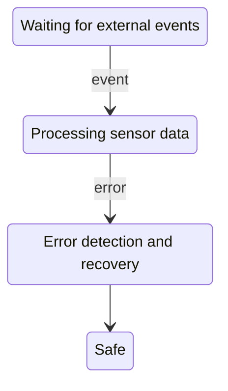

## Testing Strategy

Testing is performed at multiple levels:
- Unit testing of modules
- Integration testing of subsystems
- System-level validation

## Testability

The architecture supports testability through:
- Clear interfaces
- Dependency injection
- Hardware abstraction

## Continuous Verification

Automated tests are executed regularly
to detect regressions early.

