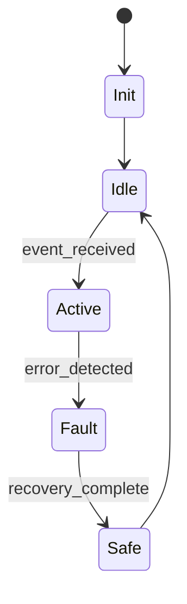

## System State Model

The high-level system behavior is modeled using a UML state machine.
States represent operational modes of the system.

```mermaid
stateDiagram-v2
    [*] --> Init
    Init --> Idle
    Idle --> Active : event_received
    Active --> Fault : error_detected
    Fault --> Safe : recovery_complete
    Safe --> Idle
```