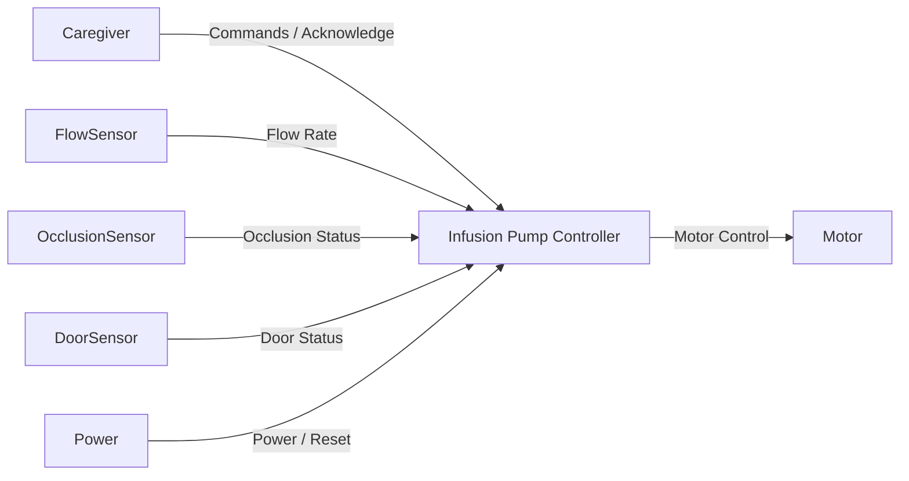
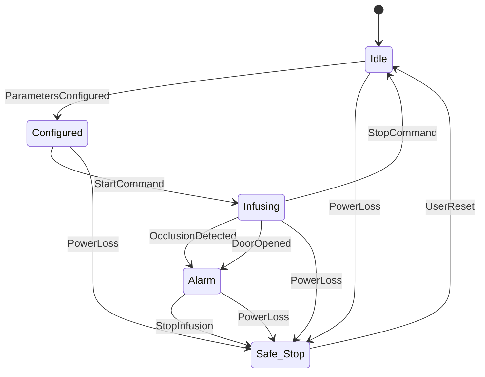

## System Boundary

### Inside the System
- Infusion control logic
- Safety monitoring and fault detection
- Alarm generation and prioritization
- Motor actuation commands
- Logging of infusion and fault events

### Outside the System
- Caregiver (user)
- Patient
- Flow sensor
- Occlusion sensor
- Door sensor
- Pump motor (actuator)
- Power supply

### Assumptions
- Sensors provide periodic updates
- Caregiver responds to alarms
- Power loss can occur at any time
- Infusion parameters are configured before start

---

## System Context

### Actors and Interfaces

| Actor / Entity | Type | Interface Description |
|---------------|------|-----------------------|
| Caregiver | User | Start/stop commands, configuration, alarm acknowledgement |
| Flow Sensor | Sensor | Flow rate measurements |
| Occlusion Sensor | Sensor | Occlusion detected signal |
| Door Sensor | Sensor | Door open/closed status |
| Pump Motor | Actuator | Motor speed / on-off control |
| Power Supply | System | Power presence / loss |

---

### System Context Diagram

## Selected Use Cases

| ID   | Use Case          | Actor            | Description                                      |
| ---- | ----------------- | ---------------- | ------------------------------------------------ |
| UC-1 | Start Infusion    | Caregiver        | Configure parameters and begin infusion          |
| UC-2 | Stop Infusion     | Caregiver        | Stop infusion manually during operation          |
| UC-3 | Handle Occlusion  | Occlusion Sensor | Detect blockage and stop infusion safely         |
| UC-4 | Handle Power Loss | Power Supply     | Transition system to safe state on power failure |

---

### Use Case Descriptions

#### UC-1: Start Infusion
- Goal: Begin medication delivery.
- Trigger: Caregiver issues a start command.
- Main Interaction: Validate configuration → enable motor → begin monitoring.
- Outcome: System enters Infusing state.

#### UC-2: Stop Infusion
- Goal: Stop medication delivery safely on user request.
- Trigger: Caregiver issues a stop command.
- Main Interaction: Disable motor → stop infusion → log event.
- Outcome: System transitions from Infusing to Idle state.

#### UC-3: Handle Occlusion
- Goal: Prevent unsafe medication delivery.
- Trigger: Occlusion sensor detects blockage.
- Main Interaction: Immediately stop motor → raise alarm → log fault.
- Outcome: System enters Alarm, followed by Safe_Stop.

#### UC-4: Handle Power Loss
- Goal: Ensure patient safety during unexpected power loss.
- Trigger: Loss of external power.
- Main Interaction: Immediately stop infusion; system resets on power restoration.
- Outcome: System enters Safe_Stop state and does not resume infusion automatically.

---

## UML Statechart (Behavioral Model)

---
## Safety and Error Handling (Behavioral View)
- Safety events override normal operation.
- Infusion is always stopped before alarms are raised.
- Power loss forces a transition to Safe_Stop from any state.
- Recovery requires explicit caregiver action.

## Change Log
| Date | Change          | Author  |
| ---- | --------------- | ------- |
|      | Initial version | Example |
